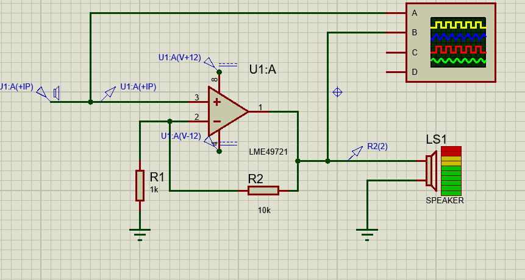
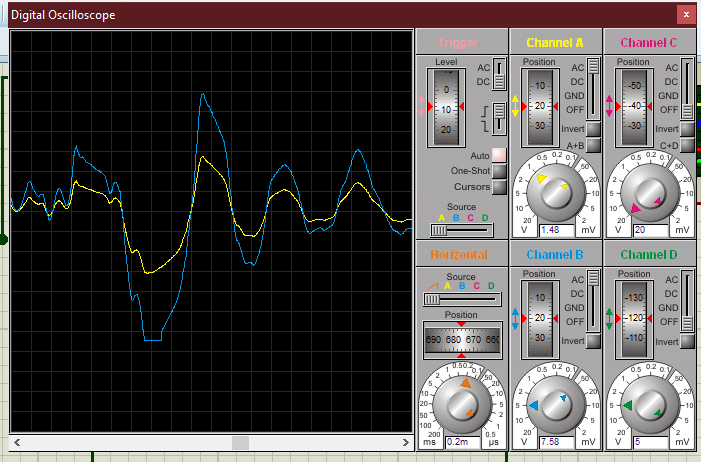

# 🔊 Amplificador Não-Inversor com LME249721 no Proteus

Este projeto demonstra o funcionamento de um **amplificador operacional não-inversor** usando o CI **LME249721** em um circuito simulado no **Proteus**. O objetivo é amplificar o sinal de áudio proveniente de um arquivo `.wav` representando uma palma (clap), e visualizar o resultado em um osciloscópio virtual.

---

## 📐 Esquema do Circuito

  

### 🧪 Configuração:
- **Tipo de amplificador**: Não-Inversor
- **CI utilizado**: LME249721
- **Fonte**: Simétrica (±12V)
- **Entradas**:
  - Sinal de áudio `.wav` (pode ser substituído por outro)
- **Saída**:
  - Canal de osciloscópio com sinal amplificado

### 🔧 Resistores:
- **R1 (entrada não-inversora para GND)**: `1kΩ`
- **R2 (realimentação da saída para entrada inversora)**: `10kΩ`

📈 **Ganho do amplificador**:
\[
\text{Ganho} = 1 + \frac{R2}{R1} = 1 + \frac{10k}{1k} = \mathbf{11x}
\]

---

## 🧰 Como Simular no Proteus

1. **Abra o projeto no Proteus**  
   Localize e abra o arquivo do projeto `.pdsprj` na pasta principal.

2. **Selecionando o arquivo de áudio (.wav)**  
   - Clique duas vezes sobre o componente de entrada de áudio (Speaker ou Signal Generator).
   - No campo `Wave File`, clique no ícone de pasta.
   - Selecione o arquivo `Single-Clap-Sound-Effect-_Free-Copyright_.wav` presente na pasta `audio para amplificação/`.
   - **Opcional**: você pode substituir por outro `.wav`, desde que seja mono, 16-bit PCM, e com amostragem compatível (ex: 44.1kHz).

3. **Inicie a simulação**  
   Clique em ▶️ (Play) na barra superior.

4. **Visualização no osciloscópio**  
   - O canal **CH A** exibe o sinal original do arquivo `.wav`
   - O canal **CH B** exibe o sinal **após amplificação**
   - Use os botões do osciloscópio virtual para ajustar a escala vertical e horizontal

---

## 📊 Exemplo de Sinal

  

---

## 💡 Observações

- O CI **LME249721** suporta alto desempenho com baixíssimo ruído, ideal para sinais de áudio.
- O ganho pode ser ajustado trocando os valores de R1 e R2, mantendo a fórmula \( 1 + \frac{R2}{R1} \).
- O circuito foi pensado para fins educacionais e simulação de sinais acústicos.

---

